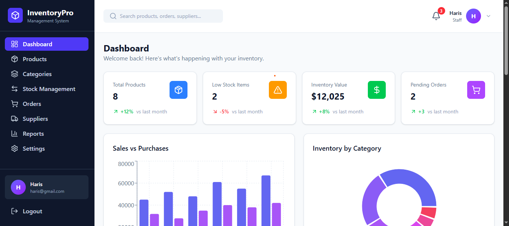
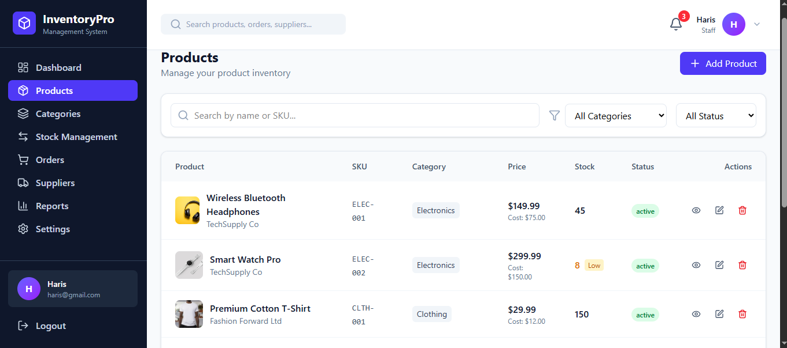
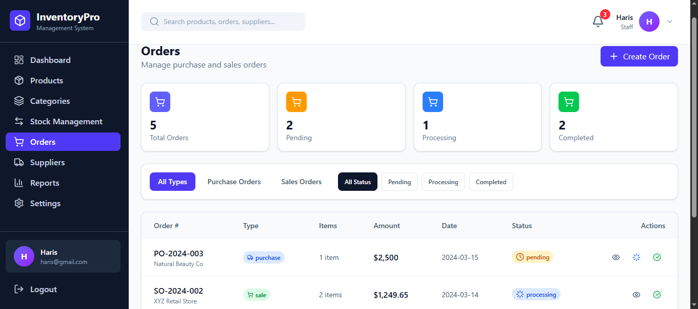

# 📦 Inventory Management System - Frontend

A modern, responsive inventory management system built with React, TypeScript, and Tailwind CSS.


---

## 📸 Screenshots

### Dashboard


### Products Management


### Orders


---

## ✨ Features

### 🎯 Core Features
- **Dashboard** - Real-time statistics, charts, alerts, and quick insights
- **Products** - Complete CRUD with search, filters, and stock indicators
- **Categories** - Product categorization with inventory overview
- **Suppliers** - Supplier management with ratings and order history
- **Orders** - Purchase and sales order management with status tracking
- **Stock Management** - Track stock in, stock out, and adjustments
- **Reports** - Comprehensive sales, purchase, and inventory reports
- **Settings** - User preferences, notifications, and system configuration

### 🔐 Authentication
- User registration and login
- Password reset functionality
- Protected routes
- Role-based access (Admin, Manager, Staff)

### 🎨 UI/UX
- Fully responsive design
- Modern and clean interface
- Interactive charts and graphs
- Real-time notifications

---

## 🛠️ Tech Stack

| Technology | Purpose |
|------------|---------|
| React 18 | UI Library |
| TypeScript | Type Safety |
| Tailwind CSS | Styling |
| React Router v6 | Navigation |
| Context API | State Management |
| Recharts | Charts & Graphs |
| Lucide React | Icons |
| Vite | Build Tool |

---

## 📁 Project Structure

```
src/
├── components/
│   ├── Layout/
│   │   ├── Header.tsx
│   │   ├── Sidebar.tsx
│   │   └── Layout.tsx
│   └── ProtectedRoute.tsx
│
├── context/
│   ├── AuthContext.tsx
│   └── InventoryContext.tsx
│
├── pages/
│   ├── auth/
│   │   ├── Login.tsx
│   │   ├── Register.tsx
│   │   ├── ForgotPassword.tsx
│   │   └── ResetPassword.tsx
│   ├── Dashboard.tsx
│   ├── Products.tsx
│   ├── Categories.tsx
│   ├── Orders.tsx
│   ├── Suppliers.tsx
│   ├── Stock.tsx
│   ├── Reports.tsx
│   └── Settings.tsx
│
├── types/
│   └── index.ts
│
├── utils/
│   └── cn.ts
│
├── data/
│   └── mockData.ts
│
├── App.tsx
└── main.tsx
```

---

## 🚀 Getting Started

### Prerequisites

Before you begin, make sure you have installed:
- Node.js 18 or higher
- npm or yarn package manager

### Installation

```bash
# Clone the repository
git clone https://github.com/yourusername/inventory-management-frontend.git

# Navigate to project directory
cd inventory-management-frontend

# Install dependencies
npm install

# Start development server
npm run dev
```

The app will open at `http://localhost:5173`

---

## 🔧 Environment Variables

Create a `.env` file in the root directory:

```env
VITE_API_URL=http://localhost:8000/api
```

| Variable | Description |
|----------|-------------|
| VITE_API_URL | Backend API base URL |

---

## 📜 Available Scripts

```bash
# Start development server
npm run dev

# Build for production
npm run build

# Preview production build
npm run preview

# Run linter
npm run lint
```

---

## 🔗 Backend API

This frontend connects to a Laravel backend API.

**Backend Repository:** [inventory-management-backend](https://github.com/dawood125/inventory-management-backend)

### API Endpoints Used

| Feature | Method | Endpoint |
|---------|--------|----------|
| Login | POST | `/api/login` |
| Register | POST | `/api/register` |
| Products | GET/POST/PUT/DELETE | `/api/products` |
| Categories | GET/POST/PUT/DELETE | `/api/categories` |
| Suppliers | GET/POST/PUT/DELETE | `/api/suppliers` |
| Orders | GET/POST/PUT/DELETE | `/api/orders` |
| Stock | GET/POST | `/api/stock-movements` |
| Dashboard | GET | `/api/reports/dashboard` |

---

## 🚀 Deployment

### Deploy on Vercel

1. Push your code to GitHub
2. Go to [vercel.com](https://vercel.com)
3. Import your repository
4. Add environment variables
5. Deploy

### Deploy on Netlify

```bash
# Build the project
npm run build

# Deploy the 'dist' folder to Netlify
```

---

## 👨‍💻 Author

**Dawood Ahmed**

- GitHub: [@dawood125](https://github.com/dawood125)  
- LinkedIn: [Dawood Ahmed](linkedin.com/in/dawood-ahmed-8953b63a2)
- Email: dawood.bhatti8812@gmail.com


---

## 🙏 Acknowledgments

- [React](https://react.dev/)
- [Tailwind CSS](https://tailwindcss.com/)
- [Vite](https://vitejs.dev/)
- [Recharts](https://recharts.org/)
- [Lucide Icons](https://lucide.dev/)